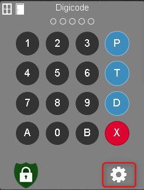

Configuration du plugin
===

## Configuration générale du plugin

Il n'y a aucune configuration générale pour ce plugin.

## Installation
Télécharger le plugin depuis le [Market](https://www.jeedom.com/market/index.php?v=d&p=market&type=plugin&&name=digicode) Jeedom

## Configuration
Une fois le plugin installé, il faut aller dans le menu Plugin -> Sécurité -> Digicode Plugin et créer un équipement.

Il faut ensuite donner les informations de votre alarme.

1 - La commande qui fournie le statut de l'alarme
2 - La commande qui active le mode Total
3 - La commande qui active le mode Partiel
4 - La commande qui déactive l'alarme
5 et 6 - Les commandes qui fournie le statut des ouvrants (virtuel généré par le résumé domotique)
7 - Délais d'activation

### Création des utilisateurs
La création, la modification et la suppression des utilisateurs se fait directement depuis le widget en cliquant sur la roue crantée qui se situe en bas à droite.

NB : cette icone est incassible lorsque l'arlame est activée.

APrès avoir cliqué sur l'icone, une fenêtre s'ouvre et permet la gestion des comptes.

